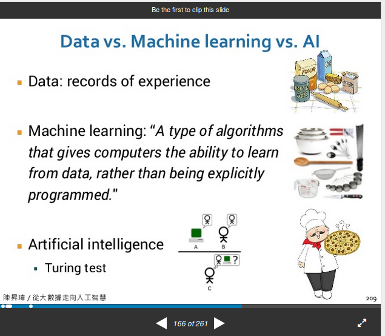
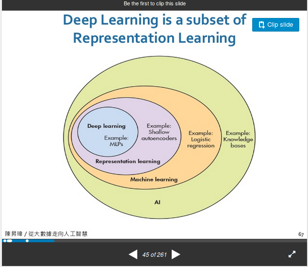

# 2018 open source
## Artificial Intelligence
- 陳昇瑋
    - 神州遊戲的data拿來寫PHD 論文
    - 台灣人工智慧學校執行長

**change is the only const**
- Alpha Go -> Alpha Zero AI
    - 人工智慧在Emulator上面的突破
        - ex: 棋類:有固定的rule , 可以百分之百觀測
         股票,說話都不行,有太多變因
        - 64 TPU

- Machine Learning vs Deep Learning
    - Machine Learning
        - Give up to define rule, Computer try to find rule by self
    - Deep Learning
        - 1. Hierarchy Machine Learning
        - 2. 準,但是rule是電腦找的 人類無法分析規則

*Polanyis Paradox: 我們懂的事*
**以前讓電腦更快更穩 現在是變聰明**


```math
f(x) = y  : x is Multidimensional
```

Deep Learning is a subset of Prepresentation Learning
- important, 絕對大多數問題都是高維度
ex: 3^361 -> 圍棋的全部可能性
Represention Learning: 在高維度中 , 嘗試去找低維度的資訊

- Picture Insert:
    - Big data: 原料
    - Machine Learning
    - Artificial Intelligence




- 傳統人力 VS Deep Learning
    - 1.瑕疵檢測
    - 2.參數調整
    - 3.預測性維護
    - 4.原料組合最佳化 : 用多種不同的原料品質,組合成可以過認證的成品
    - 5.染整色問題


`台灣人工智慧學校`
5/12-9/11

- Conclusion
    - 人工智慧適合與不適合的場景
        - 適用場景 voice video
            - Deep Learning 沒有理解 只是weak learning 需要有規則的模擬器
        - 不適用場景
            - 萬有引力 無法教給電腦

- Reference:
[從大數據走向人工智慧 ](https://www.slideshare.net/swchen11/ss-83190285)

## QEMU LLVM
- QEUM:
    - x86中emulate ARM(Android emulator
    - It can also work with KVM to control VMs

- SIMD Translation in DBT
    - SIMD : single instruction multiple data
    - DBT : Dynamic binary Translation
    - 用scalr做 效果不好

- Supported Operations
    - ARMv7 NEON does not support double precision floating-point operations
    - X86-SSE does not support multiply and add operations
    > 如何讓insttrucion在彼此之間轉換不會浪費


## 開放式的深度學習以分散式異質計算加速
- Heterogeneous Systems
    - facebook:開源系統軟體
    - opens source AI

- Deep Learning Framework
    - Tensorflow
    - Caffe
    - Keras
    - Torch

- Big Data & HPC Platform
    - Hadoop
    - Spark
    - MPI
    - CUDA

- Tensorflow相關硬體加速
    - google 自己做TPU
    - 要熟悉Linear Algebra

- I am Cheng-Yuen Liu
    - Amdahal's Law in Practice
    - function swarms
        - A Subset invoked functions and triggerd kernel events during the runtime of a program may grather as a swarm accronding to timeline due to the following relations
        - 1. Caller-callee Relation
        - 2. Thread Spawning Relation
        - 3. IPC Relation
        - 4. Resources Sharing Relation
        - 5. System calls Relation

- Candidate Tools for Dynamic Analysis
    - 1. PinTools(Vtue,Zsim)
    - 2. Gem5,Marss
    - 3. Software
        - Perf(CPU: U/k)
        - nvprof(GPU)
        - tcpdump(Net)
        - vmstat,mpstat(System)
- Falme Graph
    - Can see linux kernel function call

## Trusted Distrbuted RTOS
- BlockChain
    - Trust World Computer
    - The most significant innovation since internet
    - Distributed Ledger Technology -> Trusted Distributed Real-Time Operating System

Scheduling              | single tasking                 | Distributed File System |
| ----------------------|:------------------------------:| -----------------------:|
|Hash(2^256) (Consensus)| cryptography(Smart Contract)   | Level-DB IPFS           |

- 1500 blockchains/altconis
    - bitcon
    - ethereum
    - Corda
    - OurChain(台大老師)

- how PoW-like BlockChain Works?
```info
 wallet - TX 交易    - verify
       - Mine 挖礦
       - Mine Pool
```

- 挖礦(Mining) by finding a nonce
```info
SHA256(Block header, Random nonce) < target (difficulty)
```
- book
    - bas
        - 1. leading zero(前導零)
        - 2. Solve difficult math(解決困難數學題)
    - good
        - 未來可能會對實體世界 [賦予生命] 的十二種顛覆


## Post quantum cryptography
-  Quantum computer & its threat
    - MicroSoft and Google develop their Quantum Computers
    - 對密碼學而言不是好消息
    - 量子電腦時代 AES128 -> AES256比較安全

- Post-quantum cryptography
*Mathematical cryptography that resists attack by quantum computer*
    - Code-based encryption
        - Securiry based on the NP-completeness of general decoding problem(錯誤更正碼)
        - McEliece encryption(1978)
            - key generation
            - Encryption
            - Decryption

- Hash-based signature
    - Minimal security assumptions
    - Fast but with gigantic signature sizes
    - Lamport signature(1979)
        - key generation
        - Signature
        - Verification
    - Merkel tree
        - 改良 Lamport Signature size過大問題,可以簽好多次

- Multivariate cryptography
    - 多變量密碼系統
    - Security bases on the NP-hardness of solving quadratic polynomial systems of equations over finite fileds
    - verify fast with short signatures, but public keys are big

- Lattice-based cryptography
    - 解Lattice上面的向量問題
        - The shortest vector problem
        - The closest vector problem
        - Lattice Based Reduction
                - Given a bad basis, find a good basis such that SVP or CVP is easier

- Others
>    .....

- NIST PQC standardization
    - 制定標準 產業將會大衝擊
        - Encourage public analysis on the submitted algorithms
        - Hold conferences for researchers to share analysis and evaluation results
        - Release reports periodically and summarize the rationale for each selsection
    - Scope
        - Need to run on classical, non-quantum platforms
        - Digital signature
            - To replace those in FIPS 186-4
        - Encryption
            - To replace the key encapsulation mechanisms in SP 800-56B
        - Key agreement
            - To replace those in SP 800-56A
    - Line Up
        - Total (45 enc/KEM + 20 sig) //還沒被破解的
        - Code-based encryption (16)
        - Hash-based signature (3)
        - Multivariate cryptography (2+7)
        - Lattice-based cryptography (21+5)
        - Others (6+5)

- Summary
    - Quantum computer is coming and will break RSA ECC(Bitcoin)...
    - Post-quantum cryptography can resist quantum computer attack at a cost of larger key and/or ciphertext
    - NIST standards will be ready in 5-7 years

